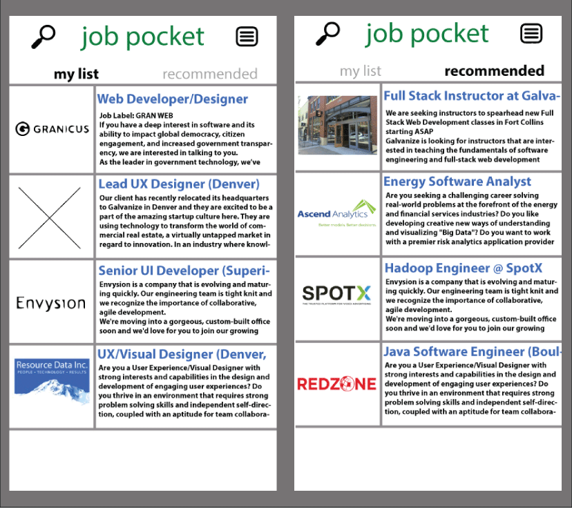
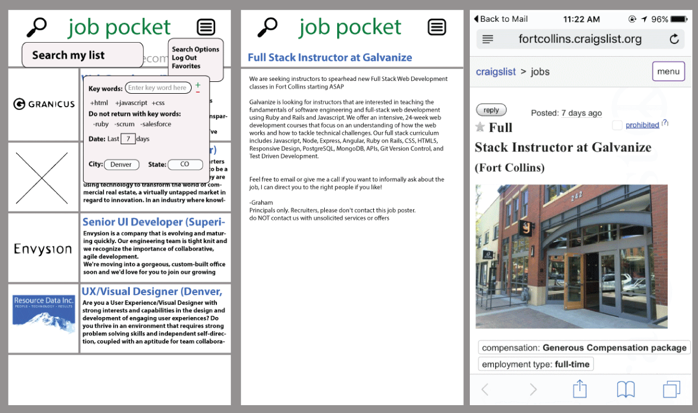

#JOB POCKET

##Description
This app, will allow job seekers to store job postings off of any site with a url that doesn't require a login to view. As a job seeker, you may come across various job postings that you would like to save and view at a later time. This app will allow you to take that url and email that url to your Job Pocket App. In addition this app will have a recommendation newsfeed section based off scraping jobs on craigslist. In the recommendation section you will have an area to enter key words that will narrow down the job recommendations.

##Features
- Time Stamp

##Technologies
- MEAN Stack
  - NodeJS
  - ExpressJS back-end - utilize mostly RESTful routes that serve JSON
  - Angular front-end
  - MongoDB (along with Mongoose or Monk)
- Gulp
- PassportJS for Authentication
- Bootstrap
- TDD
- Cheerio

##Stretch Goals
- Add Favorite Lists
- Add More search parameters

##Other
- RSS Feed- xml - grab - parse (once a day)
- Hacker News (whos hiring)
- Angular Directives templates
- Prevent duplicate Urls
- skeleton
- Import.io

##References
- http://rss-tutorial.com/index.php
- http://techcrunch.com/2014/02/18/kimono-is-a-smarter-web-scraper-that-lets-you-api-ify-the-web-no-code-required/
- https://www.quora.com/How-do-Pocket-app-Instapaper-Flipboard-etc-extract-articles-from-a-page
- http://themes.3rdwavemedia.com/website-templates/devaid-free-bootstrap-theme-developers/
- http://rawgit.com/start-angular/versatile-dashboard-theme/master/dist/index.html#/login
- http://tech.zumba.com/2014/08/02/angularjs-forget-jquery/
- http://www.technofattie.com/2015/03/02/nested-controllers-and-shared-data-in-angular.html
- Routes = https://github.com/gSchool/angular-curriculum/blob/master/Unit-2/02-routing.md
- https://spring.io/guides/tutorials/spring-security-and-angular-js/#_spring_and_angular_js_a_secure_single_page_application
- https://github.com/mjhea0/node-request-cheerio-scraper/blob/master/scrape.js
- https://www.webniraj.com/2015/03/16/nodejs-scraping-websites-using-request-and-cheerio/
- http://blog.trifork.com/2014/04/03/dynamic-web-forms-with-angularjs/

##mongo
terminal
``
mongo
show dbs
use passport_local_mongoose_express4 <to view users>
show collections
db.accounts.find().pretty()
``

##scraping
- Yahoo YQL : https://developer.yahoo.com/yql/console/?q=show%20tables&env=store://datatables.org/alltableswithkeys#h=select%20*%20from%20data.html.cssselect%20where%20url%3D%22www.yahoo.com%22%20and%20css%3D%22%23news%20a%22
- Node.io Scraping https://github.com/chriso/node.io/wiki/Scraping
- Screen scraping with nodejs http://code.tutsplus.com/tutorials/screen-scraping-with-nodejs--net-25560
- https://www.digitalocean.com/community/tutorials/how-to-use-node-js-request-and-cheerio-to-set-up-simple-web-scraping
- http://ghostproxies.com/blog/2015/09/the-ultimate-guide-to-scraping-craigslist-data-with-software/
- http://blog.ragingflame.co.za/2014/6/27/using-cheerio-and-mongodb-to-scrape-a-large-website

-https://github.com/dwyl/node-parse-rss

http://briantford.com/blog/huuuuuge-angular-apps
-Toggle example Angular(use for menu): http://jsfiddle.net/geniuscarrier/tKZjZ/

###Atom plug ins
-http://elijahmanor.com/github-atom-packages/
